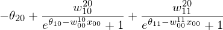
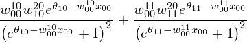
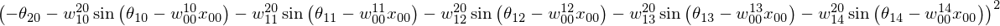

nnets
=====

Library for creating Neural Networks. A Neural Network can be created
with any architecture and activation functions. 

The network expression is computed symbolically using `sympy` ans
evaluated efficiently using `numba`. This allows to have the
advantages of a symbolic expression combined with a fast numerical
evaluation.

Multilayer perceptrons can be easily created with several helpers.

Examples
--------

Create a network with one input node one sigmoid hidden layer
and a linear output layer.


```python
import sympy
from nnets import mlp

sympy.init_printing()


simple_net = mlp.build_network(1,2,1)
simple_net.total_output_formula
```



Iterate over the nodes


```python
for node in simple_net.all_nodes:
    print("Node of type {} with formula {}".format(type(node).__name__, node.formula))
```

    Node of type InputNode with formula x_00
    Node of type HiddenNode with formula 1/(exp(theta_10 - w_00__10*x_00) + 1)
    Node of type HiddenNode with formula 1/(exp(theta_11 - w_00__11*x_00) + 1)
    Node of type OutputNode with formula -theta_20 + w_10__20/(exp(theta_10 - w_00__10*x_00) + 1) + w_11__20/(exp(theta_11 - w_00__11*x_00) + 1)


```python
import numpy as np
x = np.arange(10000000)
#Initialize network with random parameters
params = np.random.rand(simple_net.nparams)
simple_net.parameters = params
simple_net(x)
```


    array([ 0.14626265,  0.30898658,  0.44234205, ...,  0.6559327 ,
            0.6559327 ,  0.6559327 ])


Compute the derivative of the NN expression with 
respect to the input symbol


```python
formula = simple_net.total_output_formula
formula.diff(next(simple_net.input_symbols))
```




```python
import sympy
```


```python
activation = sympy.sin
```


```python
output = mlp.OutputLayer(1, lambda x: x**2)
```


```python
n = mlp.build_network(1, layer, output)
```


```python

n.total_output_formula
```



Install
-------

`nnets` requires `sympy`and `numba`. Once you have installed them, run

```
setup.py install
```
